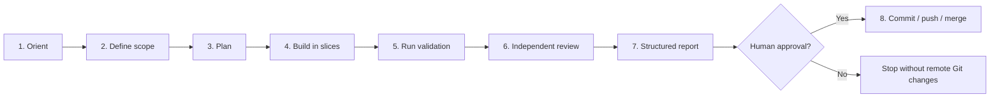
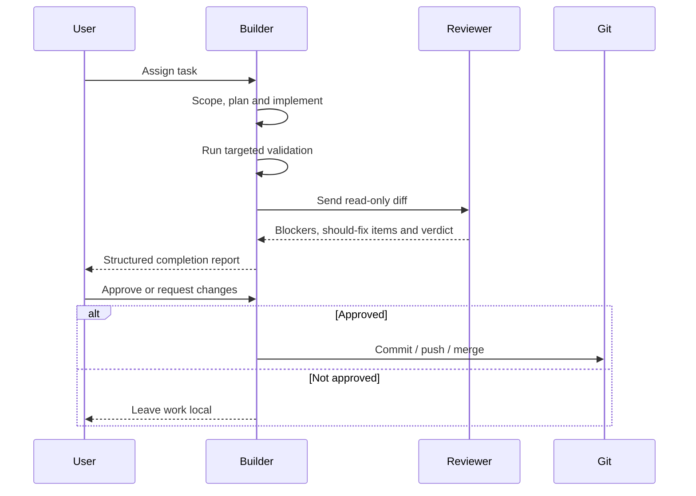
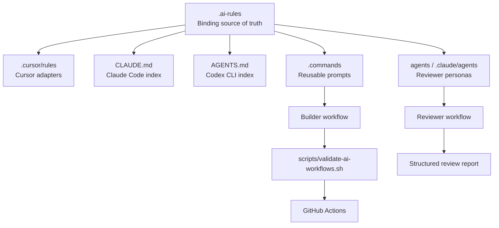

<a id="readme-top"></a>

<div align="center">

# 🤖 AI Agent Rules Template

### Reusable development rules for Cursor, Claude Code and Codex CLI

One source of truth for scope control, planning, testing, review, Git safety and AI-assisted software development.

<br />

[](https://github.com/new?template_name=ai-agent-rules-template&template_owner=tomekmisiun)
[](docs/INSTALLATION.md)
[](https://github.com/tomekmisiun/ai-agent-rules-template/releases)

<br />

[](https://github.com/tomekmisiun/ai-agent-rules-template/actions/workflows/validate-ai-rules.yml)
[](LICENSE)
[](https://github.com/tomekmisiun/ai-agent-rules-template/commits/main)
[](https://github.com/tomekmisiun/ai-agent-rules-template)
[](https://github.com/tomekmisiun/ai-agent-rules-template/issues)

<br />


</div>

---

## Table of contents

- [About](#about)
- [The problem](#the-problem)
- [What the template enforces](#what-the-template-enforces)
- [Workflow](#workflow)
- [Builder and Reviewer](#builder-and-reviewer)
- [Architecture](#architecture)
- [Supported tools](#supported-tools)
- [What is included](#what-is-included)
- [Quick start](#quick-start)
- [Adapting the template](#adapting-the-template)
- [Validation](#validation)
- [Cross-provider review](#cross-provider-review)
- [Assumptions and limitations](#assumptions-and-limitations)
- [Repository structure](#repository-structure)
- [Documentation](#documentation)
- [Contributing](#contributing)
- [License](#license)
- [Author](#author)

---

## About

**AI Agent Rules Template** is a reusable policy and workflow system for AI coding agents.

It is not an application library and it does not run inside your product. Instead, it tells coding agents:

- what to read before making changes,
- how to define scope,
- when to create a plan or specification,
- how to implement work incrementally,
- which tests and validation checks to run,
- how to perform independent code review,
- when Git operations require human approval,
- how to report completed work.

The template supports **Cursor**, **Claude Code** and **Codex CLI** through thin tool-specific adapters while keeping binding policy in one shared location.

### At a glance

| Area | Included |
|---|---|
| Shared binding rules | ✅ |
| Cursor adapters | ✅ |
| Claude Code entry point and subagents | ✅ |
| Codex CLI entry point | ✅ |
| Builder / Reviewer separation | ✅ |
| Cross-provider review scripts | ✅ |
| Static workflow validation | ✅ |
| Git approval gates | ✅ |
| Reusable prompt templates | ✅ |
| Application runtime code | ❌ |
| Automatic paid AI calls in CI | ❌ |

---

## The problem

Without a shared rule system, every AI coding tool develops its own habits.

Typical failures include:

- editing unrelated files,
- expanding scope without approval,
- skipping tests,
- weakening validation to make CI pass,
- committing or pushing without permission,
- duplicating rules across multiple tool files,
- producing reviews from the same context as the implementation,
- claiming features are complete without verified evidence.

Keeping full instructions separately in `AGENTS.md`, `CLAUDE.md` and Cursor rules creates another problem: the policy slowly drifts out of sync.

This template solves that by maintaining one canonical rule layer:

```text
.ai-rules/
```

Tool-specific files only point agents toward the correct shared rules.

---

## What the template enforces

<table>
<tr>
<td width="50%" valign="top">

### 🎯 Scope and planning

- classify the task before editing
- define objective and acceptance criteria
- define what is in and out of scope
- use one logical task per branch
- avoid drive-by refactors
- create specs for non-trivial work
- break large work into ordered task cards
- implement thin vertical slices

</td>
<td width="50%" valign="top">

### 🧪 Testing and validation

- tests for new behavior
- regression tests for bug fixes
- targeted validation before broad validation
- no deleting tests to make CI green
- real repository-specific commands
- explicit reporting of unrun checks
- separate static AI workflow validation

</td>
</tr>
<tr>
<td width="50%" valign="top">

### 🔍 Review

- Builder and Reviewer separation
- read-only review of the final diff
- cross-provider review when available
- structured Blocker / Should-fix verdicts
- security and architecture review paths
- no silent application of review fixes
- final report includes reviewer outcome

</td>
<td width="50%" valign="top">

### 🔐 Git and security

- no commit, push or merge without approval
- no AI co-author trailers
- no secrets in the repository
- security-sensitive changes require deeper review
- production validators must not be weakened casually
- threat modelling for sensitive changes
- documentation must describe verified behavior only

</td>
</tr>
</table>

---

## Workflow

Every non-trivial task is designed to follow the same lifecycle:



### Step-by-step

| Step | Agent responsibility |
|---|---|
| **Orient** | Read orchestration rules and locate relevant repository context |
| **Scope** | State objective, assumptions and explicit boundaries |
| **Plan** | Create a specification or task breakdown when complexity requires it |
| **Build** | Implement one focused vertical slice at a time |
| **Validate** | Run targeted tests first, then broader checks |
| **Review** | Ask a separate read-only Reviewer to inspect the diff |
| **Report** | Summarize files, behavior, tests, risks and reviewer verdict |
| **Git** | Perform commit, push or merge only after explicit approval |

---

## Builder and Reviewer

The template separates implementation from review.



### Why use a separate Reviewer?

The agent that wrote the implementation shares the same assumptions and blind spots as the code it produced.

A separate Reviewer:

- starts from the diff,
- does not modify files,
- applies a fixed checklist,
- challenges the implementation independently,
- can use a different AI provider.

### Preferred review mapping

| Builder | Preferred Reviewer | Fallback |
|---|---|---|
| Codex CLI | Claude Code | Codex reviewer |
| Claude Code | Codex CLI | Claude review subagent |
| Cursor | Cross-provider CLI script | Builder handoff and manual reviewer |

---

## Architecture



### One truth, many entry points

```text
.ai-rules/                    ← edit policy here
    ↑
    ├── .cursor/rules/*.mdc   ← Cursor pointers and globs
    ├── CLAUDE.md             ← Claude Code index
    ├── AGENTS.md             ← Codex CLI index
    ├── .commands/*.md        ← reusable prompt templates
    └── agents/*.md           ← optional review personas
```

Adapters should not duplicate rule bodies. When policy changes, update `.ai-rules/` once.

---

## Supported tools

| Tool | Entry point | Loading model |
|---|---|---|
| **Cursor** | `.cursor/rules/project.mdc` | Always-applied project rule plus path-based glob rules |
| **Claude Code** | `CLAUDE.md` | Loaded as the project instruction index |
| **Codex CLI** | `AGENTS.md` | Loaded as the repository instruction index |

### Cursor

Cursor receives:

- an always-applied project rule,
- backend, testing and Docker path globs,
- links to relevant `.ai-rules/`,
- optional handoff commands.

See [`docs/CURSOR.md`](docs/CURSOR.md).

### Claude Code

Claude Code receives:

- a root `CLAUDE.md`,
- optional specialized subagents,
- cross-provider review integration,
- the same binding `.ai-rules/`.

See [`docs/CLAUDE_CODE.md`](docs/CLAUDE_CODE.md).

### Codex CLI

Codex CLI receives:

- a root `AGENTS.md`,
- task classification and scope rules,
- shared validation and Git policies,
- optional cross-provider review.

See [`docs/CODEX_CLI.md`](docs/CODEX_CLI.md).

---

## What is included

### Binding rule groups

| Group | Main files |
|---|---|
| **Orchestration** | `agent-orchestration.md`, `context-map.md`, `incremental-work.md` |
| **Planning** | `planning-and-task-breakdown.md`, `spec-driven-development.md` |
| **Quality** | `architecture.md`, `api.md`, `database.md`, `testing.md` |
| **Regression safety** | `tdd-and-regression.md`, `anti-overengineering.md` |
| **Security** | `security.md`, `threat-modeling.md` |
| **Review** | `review.md`, `review-checklist.md` |
| **Repository hygiene** | `repository.md`, `git.md`, `documentation.md`, `docker.md` |
| **Agent behavior** | `learning-mode.md`, `model-routing.md`, `validation.md` |
| **Optional workers** | `workers.md` |

### Optional layers

| Path | Purpose |
|---|---|
| `.commands/` | Reusable prompts for specs, reviews, audits and handoffs |
| `agents/` | Backend, database, security and DevOps reviewer personas |
| `.claude/agents/` | Claude-specific subagents |
| `scripts/ai/` | Cross-provider reviewer wrappers |
| `docs/specs/` | Convention for feature specifications |
| `examples/` | Local configuration examples |
| `reference/` | Frozen provenance export; not active configuration |

---

## Quick start

### Requirements

- Git
- Bash
- Make
- optional: Cursor
- optional: Claude Code CLI
- optional: Codex CLI
- optional: GitHub CLI

### 1. Clone and validate

```bash
git clone https://github.com/tomekmisiun/ai-agent-rules-template.git
cd ai-agent-rules-template

make validate
```

### 2. Copy the active policy into your project

Copy the rule and adapter layers that your project needs:

```text
.ai-rules/
.cursor/rules/
.claude/
.commands/
agents/
scripts/
AGENTS.md
CLAUDE.md
```

### 3. Adapt repository-specific paths and commands

At minimum, update:

```text
.ai-rules/validation.md
.ai-rules/context-map.md
.cursor/rules/*.mdc
```

Then run:

```bash
make validate
```

Full setup instructions:

- [`docs/INSTALLATION.md`](docs/INSTALLATION.md)
- [`docs/ADAPTATION_CHECKLIST.md`](docs/ADAPTATION_CHECKLIST.md)

---

## Adapting the template

This repository deliberately avoids assuming one language or framework.

Before using it in a real project, configure the following.

### Project identity

- update README and product terminology,
- remove template-only links,
- define the real repository purpose.

### Stack and layout

- replace placeholder paths,
- adjust Cursor file globs,
- remove worker rules when no queue exists,
- point database rules at real migrations.

### Validation

Replace placeholders with real commands, for example:

```text
Unit tests:        pytest tests/unit
Integration tests: pytest tests/integration
Lint:              ruff check .
Full validation:   make validate
```

### Security

Define:

- authentication-sensitive paths,
- tenant or ownership boundaries,
- secret-management rules,
- production validation requirements.

### Review configuration

Create a local reviewer environment file:

```bash
cp examples/ai-review.env.example .ai-review.env
```

Do not commit `.ai-review.env`.

---

## Validation

Run:

```bash
make validate
```

This calls:

```bash
bash scripts/validate-ai-workflows.sh
```

### Validation checks

The static validator checks:

- required rule files,
- Cursor frontmatter,
- rule cross-references,
- shell syntax,
- broken Markdown links,
- forbidden product-specific coupling,
- absolute home-directory paths,
- likely committed secrets,
- adapter structure.

### What validation does not do

It does not:

- call Claude, Codex or Cursor,
- consume paid AI API usage,
- evaluate review quality,
- guarantee that an agent obeyed every behavioral rule,
- run your application's test suite unless you add those commands.

---

## Cross-provider review

The template can use different providers for implementation and review.

Example:

```text
Codex CLI builds
        ↓
Claude Code reviews
        ↓
Builder reports the verdict
        ↓
Human approves fixes or Git operations
```

Review models are configured through environment variables rather than hardcoded IDs:

```text
AI_REVIEW_MODEL
CLAUDE_REVIEW_MODEL
CODEX_REVIEW_MODEL
```

Cross-provider review requires the relevant CLIs to be installed locally.

See [`docs/CROSS_PROVIDER_REVIEW.md`](docs/CROSS_PROVIDER_REVIEW.md).

---

## Assumptions and limitations

### Assumptions

- a human remains responsible for Git remote operations,
- one logical task normally uses one branch,
- reviewers begin with the diff,
- different providers are preferred for non-trivial review,
- application validation is configured by the consuming repository,
- policy files are written in English,
- the `reference/` directory is read-only evidence.

### Limitations

- behavioral compliance still depends on the coding agent,
- CI performs static validation only,
- Cursor cannot always launch external reviewers automatically,
- Claude Code and Codex CLI are optional external tools,
- no application runtime code is included,
- no framework-specific rules are preconfigured,
- auto-push and auto-merge are intentionally not enabled.

---

## Repository structure

```text
.
├── .ai-rules/               # Binding shared rules
├── .cursor/rules/           # Cursor adapters and globs
├── .claude/agents/          # Claude-specific review subagents
├── .commands/               # Reusable prompt templates
├── agents/                  # Tool-neutral reviewer personas
├── docs/
│   ├── specs/               # Specification convention
│   ├── INSTALLATION.md
│   ├── ADAPTATION_CHECKLIST.md
│   ├── ARCHITECTURE.md
│   ├── CROSS_PROVIDER_REVIEW.md
│   └── ai-workflows.md
├── examples/                # Local environment examples
├── reference/               # Frozen source export
├── scripts/
│   ├── ai/                  # Cross-provider review helpers
│   └── validate-ai-workflows.sh
├── .github/workflows/
│   └── validate-ai-rules.yml
├── AGENTS.md                # Codex CLI entry point
├── CLAUDE.md                # Claude Code entry point
├── Makefile
└── README.md
```

---

## Documentation

| Document | Purpose |
|---|---|
| [`docs/INSTALLATION.md`](docs/INSTALLATION.md) | Installing the rules in another repository |
| [`docs/ADAPTATION_CHECKLIST.md`](docs/ADAPTATION_CHECKLIST.md) | Required customization checklist |
| [`docs/ARCHITECTURE.md`](docs/ARCHITECTURE.md) | Relationship between rules, adapters and workflows |
| [`docs/ai-workflows.md`](docs/ai-workflows.md) | Day-to-day agent workflow index |
| [`docs/CURSOR.md`](docs/CURSOR.md) | Cursor integration |
| [`docs/CLAUDE_CODE.md`](docs/CLAUDE_CODE.md) | Claude Code integration |
| [`docs/CODEX_CLI.md`](docs/CODEX_CLI.md) | Codex CLI integration |
| [`docs/CROSS_PROVIDER_REVIEW.md`](docs/CROSS_PROVIDER_REVIEW.md) | Cross-provider review setup |
| [`docs/two-agent-review-workflow.md`](docs/two-agent-review-workflow.md) | Builder / Reviewer operating model |
| [`docs/PORTABILITY.md`](docs/PORTABILITY.md) | Tool and repository portability |
| [`docs/SOURCE_MANIFEST.md`](docs/SOURCE_MANIFEST.md) | Source and provenance manifest |
| [`CHANGELOG.md`](CHANGELOG.md) | Release history |

---

## Contributing

Contributions should preserve the main architectural rule:

> Binding policy belongs in `.ai-rules/`. Tool adapters should remain thin.

Before submitting a pull request:

```bash
make validate
```

See [`CONTRIBUTING.md`](CONTRIBUTING.md).

---

## License

Distributed under the **MIT License**.

See [`LICENSE`](LICENSE).

---

## Author

<div align="center">

### Tomasz Misiun

[](https://github.com/tomekmisiun)
[](https://misiun.dev)

<br />

Built from production AI-workflow rules used in real application development.

</div>

---

<div align="center">

**One source of truth. Multiple coding agents. Predictable delivery.**

[Back to top](#readme-top)

</div>
