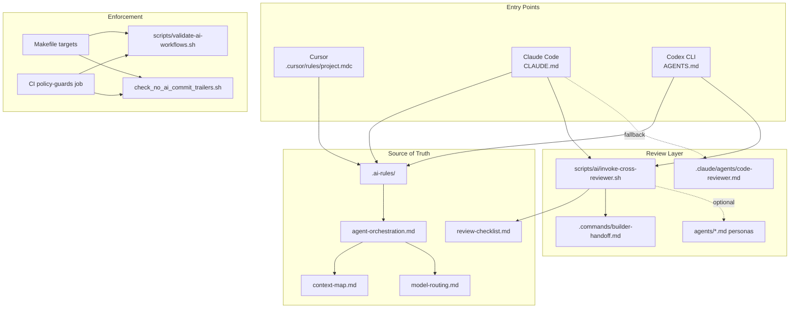

# Dependency Map

## Plain-text flow

### Cursor entry path

1. **Cursor** auto-loads `.cursor/rules/project.mdc` and `.cursor/rules/ponytail.mdc`.
2. Wrappers point to **`.ai-rules/`** as binding source of truth.
3. Agent starts with **`.ai-rules/agent-orchestration.md`** → **`.ai-rules/context-map.md`**.
4. Non-trivial changes trigger **`.ai-rules/model-routing.md` §7** review decision tree.
5. Cross-provider review: **`scripts/ai/invoke-cross-reviewer.sh`** (manual if Cursor cannot spawn).
6. Fallback: user runs other provider CLI or uses **`.commands/builder-handoff.md`** handoff.
7. Validation: **`make validate-ai-workflows`**, **`make policy-guards`** (requires Makefile integration).

### Claude Code entry path

1. **Claude Code** loads **`CLAUDE.md`**.
2. **`CLAUDE.md`** → **`.ai-rules/`**, **`docs/ai-workflows.md`**, **`docs/two-agent-review-workflow.md`**.
3. Builder completes work → **`scripts/ai/invoke-cross-reviewer.sh codex`** (cross-provider).
4. Fallback: **`.claude/agents/code-reviewer.md`** subagent.
5. Optional Stop hook: **`.claude/settings.json`** → **`.claude/hooks/codex-stop-review.sh`** (Codex exec review).
6. Policy: **`scripts/validate-ai-workflows.sh`** via **`make policy-guards`** / CI.

### Codex CLI entry path

1. **Codex CLI** loads **`AGENTS.md`**.
2. Same **`.ai-rules/`** and workflow docs as Claude.
3. Builder completes work → **`scripts/ai/invoke-cross-reviewer.sh claude`** (cross-provider).
4. Fallback: **`scripts/ai/invoke-cross-reviewer.sh codex`** (`codex review --uncommitted`).
5. Reviewer reads **`.ai-rules/review-checklist.md`** (Claude path embeds it; Codex native path cannot inject custom prompt with `--uncommitted` in CLI 0.139.0).

### Shared enforcement path

```
Makefile (validate-ai-workflows, policy-guards)
  → scripts/ci/run_policy_guards.sh [snippet only in source repo]
    → scripts/validate-ai-workflows.sh
    → scripts/ci/check_no_ai_commit_trailers.sh
      → scripts/ci/_lib.sh
      → scripts/ci/lib_ai_commit_trailers.sh
  → .pre-commit commit-msg hook
    → scripts/hooks/check_commit_msg_no_ai_trailers.sh
      → scripts/ci/lib_ai_commit_trailers.sh
  → .github/workflows/ci.yml policy-guards job [snippet]
```

### Reviewer fallbacks

| Builder provider | First choice | Fallback |
| ---------------- | ------------ | -------- |
| Codex | `invoke-cross-reviewer.sh claude` | `invoke-cross-reviewer.sh codex` |
| Claude Code | `invoke-cross-reviewer.sh codex` | `.claude/agents/code-reviewer.md` |
| Cursor | `invoke-cross-reviewer.sh` if runnable | Handoff + manual CLI |

### Broken or optional dependencies

| Reference | Status |
| --------- | ------ |
| `.codex/agents/reviewer.toml` | **Removed** — documented in `docs/two-agent-review-workflow.md` |
| `scripts/ai-two-agent.sh`, `make ai-two-agent` | **Stale guard** — must not exist; `validate-ai-workflows.sh` fails if found |
| `docs/learning/**` | **Optional** — indexed in `AGENTS.md` / `CLAUDE.md`, not required by validator |
| `docs/decisions/**`, `docs/adr/**` | **Optional** — ADR references |
| `docs/template-onboarding.md`, `TEMPLATE_FREEZE_CHECKLIST.md` | **Optional** — human template docs |
| `scripts/ci/run_policy_guards.sh` | **Mixed** — not full-copied; non-AI guards included in source |
| External `claude` / `codex` CLI | **Optional at rest** — required only when running cross-review |

## Mermaid diagram


